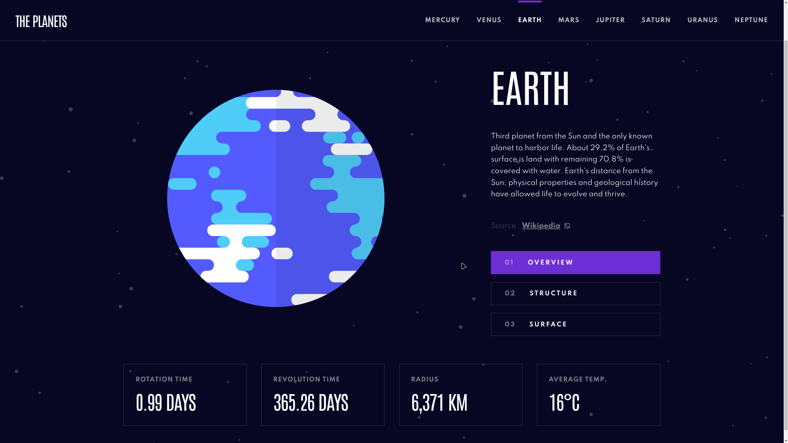

# Planets fact site solution (Frontend Mentor)

This is a solution to the [Planets fact site challenge on Frontend Mentor](https://www.frontendmentor.io/challenges/planets-fact-site-gazqN8w_f).

## Table of contents

- [Overview](#overview)
  - [The solution](#the-solution)
  - [Screenshot](#screenshot)
  - [Links](#links)
  - [Built with](#built-with)
- [Author](#author)

## Overview

### The solution

Users are able to:

- View the optimal layout for the app depending on their device's screen size
- See hover states for all interactive elements on the page
- View each planet page and toggle between "Overview", "Internal Structure", and "Surface Geology"

### Screenshot

### Links

- Solution URL: [Add solution URL here](https://your-solution-url.com)
- Live Site URL: [Vercel](https://planets-fact-five.vercel.app/)

### Built with

- [TypeScript](https://www.typescriptlang.org/) - "JavaScript with syntax for types"
- [React](https://reactjs.org/) - JS library
- [React Router](https://reactrouter.com/)
- Mobile-first workflow
- Semantic HTML5 (JSX) markup
- BEM and OOCSS methodologies in combination
- CSS Grid
- Flexbox

## Author

- Website - [qada.ge](https://qada.ge)
- LinkedIn - [Q4D4](https://www.linkedin.com/in/q4d4/)
- Twitter - [@DavidKadaria](https://www.twitter.com/DavidKadaria)
- Frontend Mentor - [@DavidKadaria](https://www.frontendmentor.io/profile/davidkadaria)
